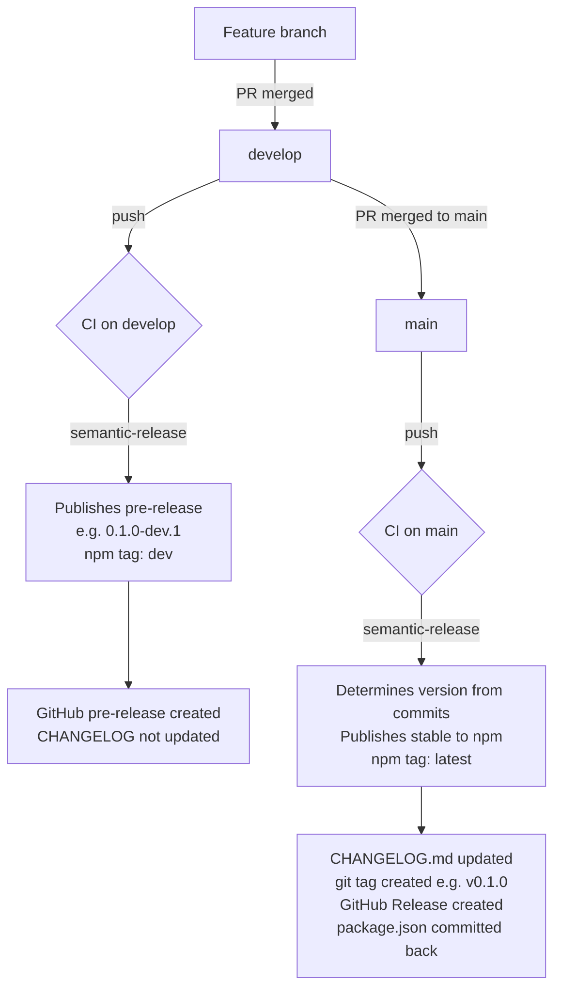

import { Meta, Title } from '@storybook/addon-docs/blocks'

<Meta title="Contributing/Project Setup" parameters={{ backgrounds: { disable: true }, direction: { disable: true } }} />

<Title>Project Setup</Title>

Everything you need to set up a local development environment and run the full toolchain.

---

## System Requirements

- **Node.js** v22 or higher
- **npm** v9 or higher
- **Docker** — required for snapshot tests and the containerised Storybook dev server

---

## Getting Started

```bash
npm install
npm run dev        # generates files, then starts Storybook in Docker at http://localhost:3000
```

To run Storybook locally without Docker:

```bash
npm run storybook  # http://localhost:3000
```

---

## Development Commands

### File Generation

Several source files are auto-generated from color configs and markdown. Regenerate them after changes to Material color config or files in `/docs`:

```bash
npm run generate:files
```

Outputs:
- `src/assets/typescript/colors.ts`
- `src/assets/styles/colors.css`
- `src/assets/styles/globals.css`
- `docs/colors.md`
- `src/components/00-foundations/colors.mdx`
- `src/components/docs/*.mdx`

### Building

```bash
npm run build       # generate files → compile TypeScript → bundle with Vite → dist/
```

### Testing

```bash
npm run test                        # full suite: type-check + lint + all tests
npm run test:storybook              # a11y tests only (51 tests)
npm run test:storybook:snapshots    # visual snapshot tests (requires Docker)
npm run test:unit                   # unit tests only
```

First-time setup — install the Playwright browser:

```bash
npx playwright install --with-deps chromium
```

### Code Quality

Run these after every change:

```bash
npm run type-check        # vue-tsc --build (stricter than --noEmit, catches JSX/slot errors)
npm run lint:fix          # eslint . --fix
npm run stylelint:css     # stylelint "src/**/*.{css,vue}"
npm run prettier:fix      # npx prettier --write src/
```

---

## Project Structure

```
src/
├── assets/
│   ├── icons/              # SVG icons
│   ├── styles/             # Global CSS, tokens, mixins (colors.css + globals.css auto-generated)
│   └── typescript/         # Auto-generated TypeScript color types
├── components/
│   ├── 00-foundations/     # Design system foundations (Typography, Colors, Breakpoints, Icons)
│   ├── 01-atoms/           # Basic building blocks (Button, Input, Badge, Icon…)
│   ├── 02-molecules/       # Combinations of atoms (Card, Accordion, Dropdown, Select…)
│   ├── 03-organisms/       # Complex compositions (Navigation, Footer, Hero, FeatureLine…)
│   ├── 04-templates/       # Page-level layout shells (reserved for future use)
│   ├── 05-pages/           # Full-page Storybook examples — not exported from the library
│   ├── 06-contributing/    # Contributor documentation (this section)
│   ├── 99-drafts/          # Work in progress — not exported
│   └── docs/               # Auto-generated Storybook MDX docs (do not edit manually)
├── stores/                 # Shared Vue state (e.g. sheet stacking)
├── utils/                  # Utility functions (classNames, WCAG contrast, ID generation…)
└── index.ts                # Library entry point — all public exports

scripts/
├── generate-colors.ts      # Color CSS/TS generation with WCAG validation
├── generate-globals.ts     # Global CSS token generation
├── generate-docs.ts        # Storybook MDX generation from /docs markdown
└── pre-flight.ts           # Orchestrates all generation scripts

docs/
├── getting_started.md      # User-facing getting started guide
├── color-accessibility.md  # Color system and WCAG strategy
└── colors.md               # Auto-generated color reference table
```

---

## Creating a New Component

Each component lives in a dedicated folder at the appropriate atomic level:

```
ComponentName/
├── NeoComponentName.vue            # Main component
├── NeoComponentNameTypes.ts        # TypeScript types and constants
├── NeoComponentName.stories.tsx    # Storybook stories
├── NeoComponentName-layout.css     # Sizing, spacing, layout CSS variables
└── NeoComponentName-themed.css     # Color and theme CSS variables
```

Steps:

1. Create the folder in the correct atomic level (`01-atoms` through `03-organisms`)
2. Define types and constants in `*Types.ts` — use `as const` arrays to derive union types
3. Implement the component using `getClassNames` for BEM class composition
4. Write Storybook stories covering all variants; tag key stories with `snapshot`
5. Export component and types from `src/index.ts`
6. Run `npm run test` to verify accessibility and type correctness

---

## Development Guidelines

- Follow the CSS variable naming pattern: `--ComponentName-category-property`
- Use logical CSS properties (`inline-size`, `padding-block`) — physical properties are linted as errors
- Declare component CSS variable defaults in `*-layout.css` / `*-themed.css`; use them in scoped styles — never reference `--neo-*` tokens directly in property declarations
- Run `npm run test` before committing
- See **Contributing/Architecture** for the full component API and CSS conventions

---

## Release Process

Releases are fully automated via **semantic-release**. You never manually change the `version` field in `package.json` — the CI does it for you based on commit messages.

### Branch → Release flow



### Commit type → version bump

| Commit type | Example | Version bump |
|---|---|---|
| `fix` | `fix(button): correct focus ring color` | Patch — `0.1.0` → `0.1.1` |
| `feat` | `feat(table): add sortable columns` | Minor — `0.1.0` → `0.2.0` |
| Breaking change | `feat!: remove deprecated prop` | Minor — `0.1.0` → `0.2.0` ¹ |
| `chore`, `build`, `docs`, `style`, `refactor`, `test` | — | No release |

> ¹ Breaking changes bump the **minor** (not major) until the library reaches production-stable `1.0.0`. When the library is ready for its first stable release, update `.releaserc.json` to change `"breaking": true → "release": "major"`.

### Marking a breaking change

Two equivalent ways — both trigger a minor version bump:

```bash
# Option A: exclamation mark after the type
feat!: remove deprecated `text` prop from NeoButton

# Option B: BREAKING CHANGE footer (allows a longer description)
feat(button): remove deprecated prop

BREAKING CHANGE: The `text` prop is removed. Use the default slot instead:
<NeoButton color="blue" variant="primary">Label text</NeoButton>
```

### Dev pre-releases

Every push to `develop` publishes a pre-release to npm tagged `dev`:

```bash
npm install neo-materia@dev   # always gets the latest dev build
```

Old dev builds are deprecated automatically by CI after each new publish.
